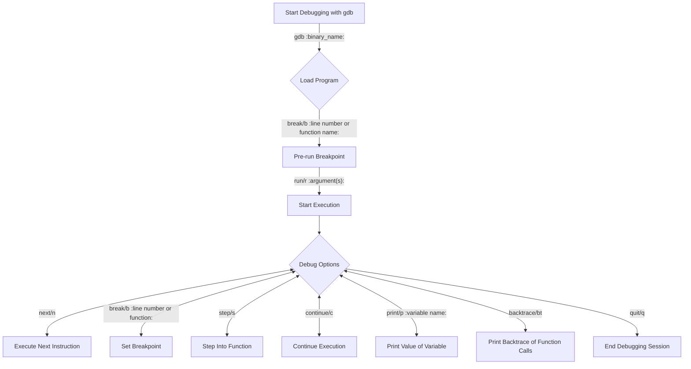

import Tabs from '@theme/Tabs'
import TabItem from '@theme/TabItem'

# Debugging with `gdb`

Learn how to use `gdb` to debug tricky problems.

## What is `gdb`?

`gdb` is program that allows you to debug your own programs. It's a dynamic debugger, which means it attaches to your program as it runs, and you can interact with your program like a surgeon operating on a patient. This guide will teach you how to use `gdb` to debug your own programs.

## `gdb` flowchart

Here's a flowchart of the commands you'll use in `gdb`, from start to finish. The commands needed are the labels of the arrows, and the arguments to the commands are wraped in `:`. Optional arguments are wrapped in `::`. Commands like `next/n` mean that you can use either `next` or `n` to execute that command.

Lastly, all of the `Debug Options` commands can be repeated by pressing `↩` (enter) without typing anything.

:::danger README

Each rectangle node in the chart is clickable and will take you to the section of this guide that covers that command more in depth.

:::



## Starting `gdb`

**Quick note to MacOS users** - If you're on MacOS, you actually won't use the `gdb` command. Any time you would use `gdb` from this guide, replace it with `lldb`. The commands are the same, but the name of the program is different.

:::info Before using `gdb`

Before using `gdb` on your program, it needs to be compiled with the `-g` flag. It can go anywhere in the command. I usually put it at the end, but it doesn't matter.

:::

To start `gdb`, you need to run the command `gdb` followed by the name of the binary you want to debug. For example, if you want to debug the binary `hello`, you would run the command `gdb hello`.

```bash
# compile your program
g++ hello.cpp -o hello -g
gdb hello
```

## Pre-Run

During this phase, you'll set any [breakpoints](#setting-breakpoints) you want to set, and then start the execution of your program.

## Start Execution

To start the execution of your program, you'll use the `run` command. You can also use the `r` command, which is a shortcut for `run`.

From here on out, your prompt will change to `(gdb)`. Just note that it's not a part of the command you're typing.

### Run

```bash
(gdb) run

# or

(gdb) r
```

### Run with Arguments

A lot of the time, your program will need command line arguments to run. To pass arguments to your program, you can use the `run` command with arguments.

```bash
(gdb) r arg1 arg2 arg3 ...
```

## Setting Breakpoints

Breakpoints are the most important part of debugging. When you set a breakpoint, it's like putting a stop sign in your program at a certain line. When your program reaches that line, it will stop and let you inspect the state of your program.

### Break

To set a breakpoint, you'll use the `break` command. You can also use the `b` command, which is a shortcut for `break`. You can set a breakpoint by line number or by function name.

```bash
# break on line 5 of your entire program
(gdb) break 5

# break on the function `main`
(gdb) break main
```

## Next Instruction

Once you've hit a breakpoint, you can use the `next` command to execute the next instruction. You can also use the `n` command, which is a shortcut for `next`. Keep in mind that `next` will not take you into a function that's being called. It will execute it and then move on to the next line.

```bash
(gdb) next

# or

(gdb) n
```

## Step Into Function

If you're on a line that calls a function, you can use the `step` command to step into that function. You can also use the `s` command, which is a shortcut for `step`. Unlike `next`, `step` will take you into the function that's being called.

```bash
(gdb) step

# or

(gdb) s
```

## Continue Execution

If you wish to continue executing your program until it hits another breakpoint or finishes/crashes, you can use the `continue` command. You can also use the `c` command, which is a shortcut for `continue`.

```bash
(gdb) continue

# or

(gdb) c
```

## Print Variable

Often times you'll want to print the value of a variable to see what it is. To do this, you can use the `print` command. You can also use the `p` command, which is a shortcut for `print`.

```bash
# print the value of the variable `x`
(gdb) print x

# or

(gdb) p x
```

## Backtrace

You'll usually use this command when your program crashes. It will print the "backtrace" of your program, which is a list of all the functions that were called before the crash, in order from the most recent to the oldest. The command is `backtrace`, but you can also use the `bt` command, which is a shortcut for `backtrace`.

```bash
(gdb) backtrace
frame 0: 0x0000000100003640 a.out this_will_crash(str="Hello World") at b.cpp:8:10
frame 1: 0x000000010000369d a.out main at b.cpp:14:20
frame 2: 0x000000010001552e dyld start + 462
```

Reading it's output, you can see that the crash happened on line 8 of `b.cpp`, which is the line that calls the function `this_will_crash()` with an argument `str="Hello World"`. The function `this_will_crash()` was called from line 14 of `b.cpp`. So as you can see, the backtrace is a list of all the functions that were called before the crash, in order from the most recent to the oldest. Hence the name back**trace**.

## End Debugging Session

To end your debugging session, you can use the `quit` command. You can also use the `q` command, which is a shortcut for `quit`.

```bash
(gdb) quit
```

## More Useful Commands

There's a ton of commands in `gdb`, and the ones listed above are the most useful in general. Here's a few more if you want more control and like using `gdb`

- `start` - this command starts the program being debugged and stops at the first instruction.

- `jump` - this command allows you to jump to a specific location in the program and continue executing from there.

- `watch` - this command sets a watchpoint, which triggers a breakpoint when a specified memory location is written to or read from.

- `rwatch` - this command sets a read watchpoint, which triggers a breakpoint when a specified memory location is read.

- `awatch` - this command sets a write watchpoint, which triggers a breakpoint when a specified memory location is written to.

- `shell` - this command allows you to run shell commands while in GDB, which can be useful for things like running scripts or viewing system information.
